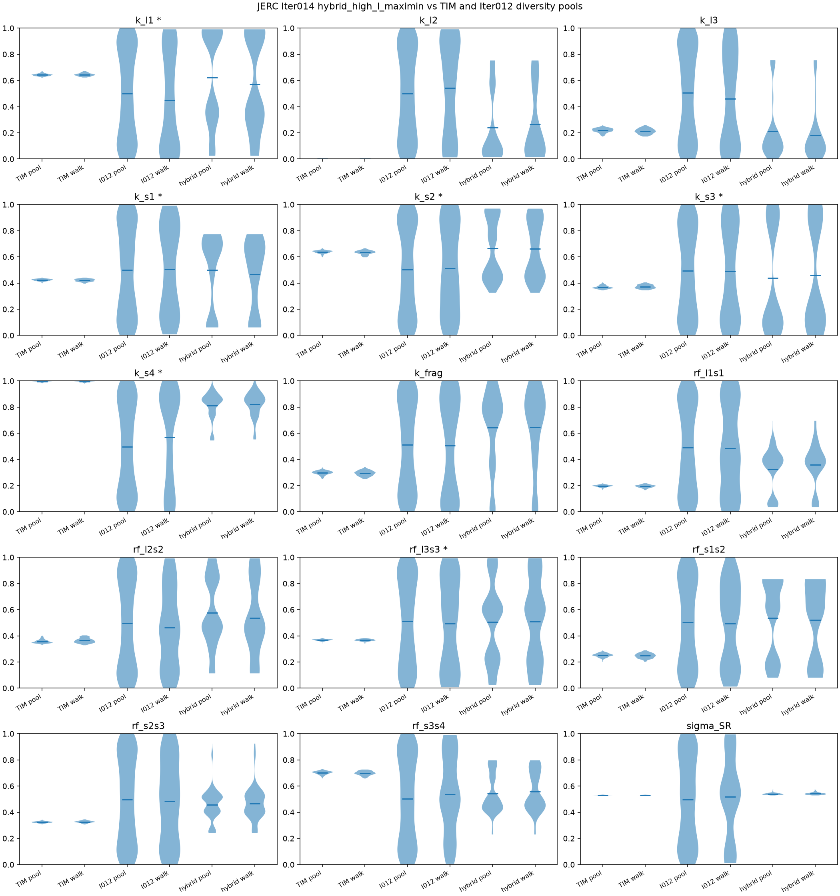

# Iter014 — JERC high-likelihood candidate-pool reconstruction

Decision: `partial_repair`

## Outcome

Iter014 tested whether rebuilding the JERC 640-member candidate pool from the frozen Iter012
Revision1 ledger under two high-likelihood rules repairs the Iter012 diversity-pool mixing
failure. Variant A (`rank_dominated`) failed locked pool geometry gates before MCMC.
Variant B (`hybrid_high_l_maximin`) completed diagnostic `64 × 8000` chains and improved
cross-seed agreement versus the Iter012 control without clearing full repair thresholds.
Overall decision: `partial_repair`. No posterior is promoted.

## Comparison setup

All MCMC rows below are JERC **hourly / DEMove 0.75**, seeds **9009 / 9010 / 9011**, sharing
the same forcing/spinup artifacts, physical bounds, and 51,882 valid hourly SR observations.

| Run | Pool / starts | Chain length | Role |
| --- | --- | --- | --- |
| **Iter011 baseline** | TIM high-L neighborhood | 64 × 8,000 | Pre-production TIM pilot control |
| **Iter012 control** | Sobol + L-BFGS-B diversity pool (Revision1) | 64 × 32,000 | Production-pipeline diversity baseline |
| **Iter014 `rank_dominated`** | Top-640 ledger states by log posterior | — | Variant A; geometry-gated |
| **Iter014 `hybrid_high_l_maximin`** | logp ≥ 0.90 quantile, then strata/maximin to 640 | 64 × 8,000 | Variant B; MCMC-evaluated |

Iter011 skill is the mean of three per-seed MAP (`optimized_best`) tables. Iter012 and
Iter014 skill use canonical pooled evaluations. Iter011 cross-seed disagreement is reported
as **width fraction**; Iter012 and Iter014 use **normalized Wasserstein** — related screens,
not identical statistics.

## Variant outcomes

| Pool rule | Geometry | MCMC | Mean acc | Cross-seed W | Decision |
| --- | --- | ---: | ---: | ---: | --- |
| `rank_dominated` | fail (`cond≈1.72e7`) | skipped | — | — | `geometry_gate_failed` |
| `hybrid_high_l_maximin` | pass (`cond≈359`) | 3×64×8000 | 0.1898 | 0.4365 | `partial_repair` |

Iter012 control reference: mean acc ≈0.1866; W ≈0.5484.

## MCMC diagnostics

| Metric | Iter011 baseline | Iter012 control | Iter014 `rank_dominated` | Iter014 `hybrid_high_l_maximin` |
| --- | ---: | ---: | ---: | ---: |
| Chain setup | 64 × 8,000 | 64 × 32,000 | — (no MCMC) | 64 × 8,000 |
| Mean acceptance (9009 / 9010 / 9011) | 0.361 / 0.349 / 0.344 | 0.182 / 0.221 / 0.157 | — | 0.089 / 0.221 / 0.259 |
| Mean acceptance (all seeds) | **0.351** | **0.187** | — | **0.190** |
| Transformed saturation | 0.000 | 0.042 | — | 0.001 |
| Min post-burn steps / τ | **56.9** | **3.5** | — | **2.7** |
| Max τ stability (across seeds) | **0.103** | **2.342** | — | **1.468** |
| Cross-seed disagreement | width **0.0041**† | W **0.548** | — | W **0.437** |
| Max rank-normalized split R̂ | not reported | **2.224** | — | **2.044** |
| Min bulk ESS | not reported | **241** | — | **254** |
| Min tail ESS | not reported | **1,746** | — | **218** |
| Outcome label | inconclusive (eligible) | fixed_length_inconclusive | geometry_gate_failed | fixed_length_inconclusive |

† Iter011 reports cross-seed **width fraction**; Iter012/014 report **normalized Wasserstein**.

## Model skill (SR on 51,882 valid hourly obs)

| Metric | Iter011 baseline | Iter012 control | Iter014 `rank_dominated` | Iter014 `hybrid_high_l_maximin` |
| --- | ---: | ---: | ---: | ---: |
| **MAP** RMSE | **0.668** | **0.665** | — | **0.667** |
| MAP bias | +0.002 | −0.002 | — | −0.000 |
| MAP R² | 0.384 | 0.390 | — | 0.387 |
| MAP KGE | 0.455 | 0.456 | — | 0.457 |
| **Posterior median** RMSE | not pooled‡ | 0.679 | — | **0.667** |
| Posterior median bias | — | −0.113 | — | −0.029 |
| Posterior median R² | — | 0.364 | — | 0.386 |
| Posterior median KGE | — | 0.480 | — | 0.455 |

‡ Iter011 skill is the mean of three per-seed MAP tables; no pooled posterior-median evaluation
was archived.

## Metric-by-metric analysis

### Mean acceptance

Iter011 TIM starts accepted ~35% of proposals — healthy for DE-mixture at 0.75. Iter012
diversity-pool production dropped to ~19% mean acceptance, with two of three seeds below the
0.20 floor. Iter014 hybrid is essentially unchanged in the mean (0.190 vs 0.187) but more
dispersed across seeds (0.089 / 0.221 / 0.259). Hypothesis: high-L+maximin membership narrows
the occupied parameter region versus the full diversity pool, yet seed 9009 still lands in a
basin where the fixed 0.75 scale is too large, while seeds 9010/9011 recover healthier rates.
Acceptance alone does not distinguish hybrid from control; it is not the repair lever.

### Transformed saturation

Iter011 had zero transformed-wall occupancy. Iter012 rose to 4.2% as diverse-pool walkers
reached prior/transform edges on parameters such as `k_l1`, `rf_l3s3`, and `k_l3`. Iter014
hybrid is near zero again (0.001). Hypothesis: restricting to a high-L subspace plus maximin
spacing keeps walkers off transform walls relative to the diversity pool, but this does not
by itself restore cross-seed agreement.

### Min post-burn steps / τ and τ stability

Iter011 maintained ~57 minimum steps per τ with τ stability ≤0.10 — consistent with a
locally coherent TIM neighborhood on an 8,000-step window. Iter012 collapsed to 3.5 steps/τ
with τ stability 2.34, indicating slow mode switching or stuck basins across a 32,000-step
run. Iter014 hybrid is worse than Iter011 (2.7 steps/τ, stability 1.47) despite matching
Iter011 chain length. Hypothesis: hybrid pools start closer in likelihood than the diversity
pool but still seed distinct basins; 8,000 steps are insufficient to equilibrate the slowest
timescales, and τ estimates remain unstable. The partial W improvement is not accompanied by
restored autocorrelation health.

### Cross-seed disagreement

This is the primary repair screen. Iter011 width 0.004 shows tight seed agreement under TIM
geometry. Iter012 W 0.548 confirms three seeds are not sampling one posterior. Iter014 hybrid
W 0.437 is a **20% relative improvement** versus Iter012 but remains **~100× worse** than
Iter011 and far above the locked repair gate (W ≤ 0.05). Hypothesis: high-L pool membership
reduces but does not remove multimodal occupancy; maximin spacing within the high-L shell
helps, yet independent seeds still converge to different basins on the 8,000-step budget.

### Split R̂ and ESS

Iter012 max R̂ 2.22 and Iter014 hybrid 2.04 both indicate non-convergence across walkers.
Bulk ESS minima are similar (~241–254) on 15 dimensions — tiny relative to the 8,000/32,000
draw budget. Tail ESS diverges: Iter012 1,746 vs hybrid 218. Hypothesis: Iter012’s longer
run accumulated more tail draws despite poor mixing; hybrid’s shorter run has not resolved
tail behavior. Neither campaign meets convergence promotion criteria.

### MAP skill

MAP RMSE is essentially flat across all MCMC-evaluated runs (0.665–0.668), with R² ≈0.38–0.39
and KGE ≈0.455–0.457. Hypothesis: each campaign finds a similarly good local hourly SR
compromise regardless of pool rule; initialization changes mixing geometry, not the existence
of a strong local MAP.

### Posterior median skill

Iter012 posterior median RMSE 0.679 is **worse** than its MAP (0.665) with large negative
bias (−0.113), reflecting pooled samples drawn from disagreeing seeds/basins. Iter014 hybrid
posterior median RMSE 0.667 matches MAP almost exactly, with bias −0.029. Hypothesis: hybrid
high-L starts keep posterior mass closer to the MAP manifold even when seeds disagree, but
the disagreement is still large enough to fail the W gate. Skill is not degraded by hybrid
reconstruction the way Iter012 diversity pooling degraded the median; mixing repair is partial,
not complete.

### `rank_dominated` geometry gate

Pure top-640 rank selection produced condition number ≈1.7×10⁷ at rank 15, exceeding the
1×10⁶ gate. Hypothesis: the ledger top-likelihood states lie on an ill-conditioned high-L
ridge — numerically tight in likelihood but geometrically degenerate for DE-mixture MCMC.
This is scientific evidence that rank-dominated pools are infeasible under locked gates, not
a pipeline defect.

## Initialization-cloud overlay (TIM vs Iter012 vs hybrid)

Post-closeout overlay of prior-normalized start clouds at JERC. TIM is the Iter009/011
high-L neighborhood; Iter012 is the diversity control; hybrid is the Iter014 rebuilt pool
and its three production walker unions. `rank_dominated` is omitted (no MCMC-eligible pool).

| Cloud | n | Mean prior-normalized spread | Max spread | Mean pairwise distance |
| --- | ---: | ---: | ---: | ---: |
| TIM pool | 1,208 | **0.054** | 0.094 | 0.053 |
| TIM walk | 192 | **0.053** | 0.094 | 0.069 |
| hybrid pool | 640 | **0.722** | 1.00 | 1.260 |
| hybrid walk | 192 | **0.721** | 1.00 | 1.279 |
| Iter012 pool | 640 | **0.999** | 1.00 | 1.799 |
| Iter012 walk | 192 | **0.991** | 1.00 | 1.818 |

| Pair | Max per-param W | Overlap left→right (radius 0.05) | Overlap right→left |
| --- | ---: | ---: | ---: |
| TIM walk vs Iter012 walk | 0.540 | 0.00 | 0.00 |
| TIM walk vs hybrid walk | **0.419** | **0.00** | 0.00 |
| TIM pool vs hybrid pool | 0.405 | 0.00 | 0.00 |
| Iter012 walk vs hybrid walk | **0.284** | **0.27** | 0.59 |
| Iter012 pool vs hybrid pool | 0.324 | 0.03 | 0.59 |

Hybrid is a **wide high-L shell**, not a TIM neighborhood. Pool and walker clouds coincide
inside that shell. Overlap with TIM remains 0 (W 0.42, largest on `k_frag`); overlap with
Iter012 walkers is partial (0.27). Highlighted rate parameters (`k_s*`, `k_frag`, `rf_*`)
are shifted versus TIM. `sigma_SR` is the exception: hybrid and TIM both spike near 0.53
(W 0.011) while Iter012 is broad. This geometry matches the MCMC partial repair: hybrid is
narrower than diversity, still ~13× wider than TIM, and still **separated** from the
Iter011 start cloud.

## Corner plot guide

Iter014 has two corner products. They are not interchangeable: different scope, burn/thin,
parameter set, and plotting library.

| | Production `corner_plot.png` (per seed) | Evaluation `physical_corner.png` (pooled) |
| --- | --- | --- |
| Writer | `MCMC.py` via `MCMC_forcing` post-processing | `evaluate_iter014.py` |
| Scope | One seed (64 walkers) | Seeds 9009+9010+9011 stacked |
| Burn / thin | Iter008 adaptive discard (~20% or 5τ) and thin ≥5 | Evaluator `descriptive_discard`; no thin; subsample 2,000 (rng 14014) |
| Parameters | 14 soil params (`sigma_SR` omitted) | 15 physical params (includes `sigma_SR`) |
| Style | `corner` contours, median±error titles, off-diagonal R² | Matplotlib histograms + faint scatter; no contours |
| Question | Did **this restart** mix? | What does the **combined** MCMC sample look like? |

Use them with the init overlay:

1. `parameter_overlay.png` — **starts** (prior-normalized pool/walker clouds).
2. Per-seed `plots/corner/corner_plot.png` — **where one restart ended**. Split peaks are
   within-seed multimodality. R² is within-seed trade-off / non-identifiability.
3. Pooled `physical_corner.png` — **evaluation posterior** used for median/MAP skill.
   Extra islands versus any single seed are often **cross-seed disagreement**, not extra
   within-seed structure. Confirm with cross-seed W (0.437) and per-seed acceptance.
4. Do not compare the two corners pixel-for-pixel: different thinning, different `sigma_SR`
   inclusion, and different sample counts.

Hybrid reading: seed 9009 (acc 0.089) is the split/poor-coherence restart; 9010/9011
(acc 0.221 / 0.259) are tighter and more unimodal. The pooled physical corner looks more
multimodal than 9010 or 9011 because it stacks 9009 with two other basins. That matches
`fixed_length_inconclusive` and partial repair versus Iter012, not TIM-like seed agreement.

## Conclusions

1. **High-L rank pools are not viable.** `rank_dominated` fails geometry before MCMC. Top
   ledger states form an ill-conditioned ridge unsuitable as a 640-member DE-mixture pool.

2. **Hybrid high-L+maximin is a partial repair.** Versus Iter012 diversity control, hybrid
   improves cross-seed W (0.437 vs 0.548) and keeps posterior median skill aligned with MAP.
   It does **not** reach Iter011 TIM-like agreement (width 0.004) or locked repair thresholds
   (mean acc ≥ 0.25 and W ≤ 0.05). Decision: `partial_repair`. The overlay explains the
   size of that gain: hybrid walkers overlap 27% of Iter012 walkers and cut mean spread from
   0.99 to 0.72, but remain separated from TIM.

3. **Initialization geometry remains the dominant lever, and hybrid did not occupy TIM.**
   MAP skill is unchanged (~0.67 RMSE). Mixing tracks start geometry. Iter013 showed TIM
   versus Iter012 as `separated` / `diversity_dominated`. The Iter014 overlay shows hybrid
   is still **separated from TIM** (walker overlap 0, W 0.419) with mean spread 0.72 versus
   TIM 0.05. q=0.90+maximin is not a TIM neighborhood.

4. **A high-L 640-pool on short chains cannot recover Iter011 mixing if the cloud is not
   TIM-compact.** Hybrid used Iter011’s 8,000-step budget on a 0.72-wide shell, not on the
   TIM ridge. Iter012’s 4× longer run on a prior-filling pool also failed. Neither “more
   steps on diversity” nor “high-L shell of similar width on short chains” closes the JERC
   gap. The next geometric lever is **compactness / TIM-neighborhood occupancy**, not another
   mild high-L shell of comparable spread.

5. **No posterior promotion.** Both MCMC-evaluated variants carry `fixed_length_inconclusive`
   diagnostic labels. Pool reconstruction is necessary but geometrically insufficient.
   Planning-only Iter015 should treat compactness and TIM-neighborhood occupancy as the
   primary lever, with proposal-scale and length as secondary — without TIM revert or new
   search.

## Artifact paths

- Output root: `/xdisk/chopinsong/tianyihu/E3SM_out/SOIL_project/spinup_forcing_coupling/spinup_forcing_coupling_iter014`
- Aggregate: `development/spinup_forcing_coupling/summaries/iter014/aggregate_result.json`
- Hybrid evaluation: `development/spinup_forcing_coupling/summaries/iter014/hybrid_high_l_maximin_evaluation_result.json`
- Rank stub: `development/spinup_forcing_coupling/summaries/iter014/rank_dominated_evaluation_result.json`
- Iter012 control: `development/spinup_forcing_coupling/summaries/iter012/jerc_evaluation_result.json`
- Iter011 baseline metrics: `development/spinup_forcing_coupling/summaries/iter011/six_configuration_seed_metrics.csv`
- Init-cloud overlay plot: `development/spinup_forcing_coupling/summaries/iter014/parameter_overlay.png`
- Init-cloud stats: `development/spinup_forcing_coupling/summaries/iter014/cloud_stats.json`
- Overlay run dir: `/xdisk/chopinsong/tianyihu/E3SM_out/SOIL_project/spinup_forcing_coupling/spinup_forcing_coupling_iter014/pool_rebuild/hybrid_high_l_maximin/`
- Pooled physical corner: `/xdisk/chopinsong/tianyihu/E3SM_out/SOIL_project/spinup_forcing_coupling/spinup_forcing_coupling_iter014/evaluation/hybrid_high_l_maximin/artifacts/physical_corner.png`
- Per-seed production corners: `/xdisk/chopinsong/tianyihu/E3SM_out/SOIL_project/spinup_forcing_coupling/spinup_forcing_coupling_iter014/production/hybrid_high_l_maximin/seed_{9009,9010,9011}/plots/corner/corner_plot.png`
- Accounting: `/xdisk/chopinsong/tianyihu/E3SM_out/SOIL_project/spinup_forcing_coupling/spinup_forcing_coupling_iter014/accounting.csv`
